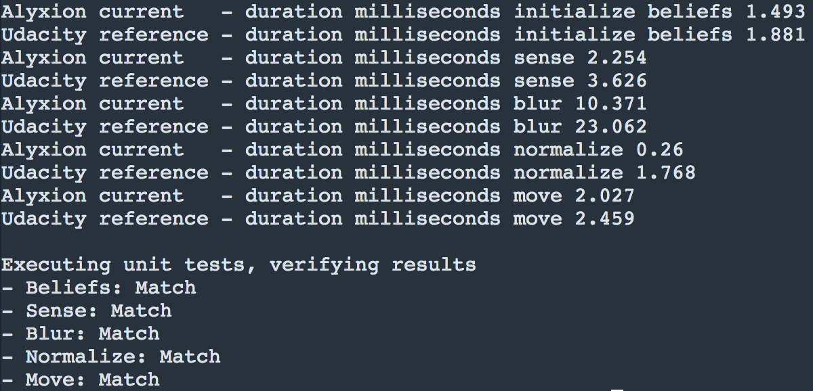
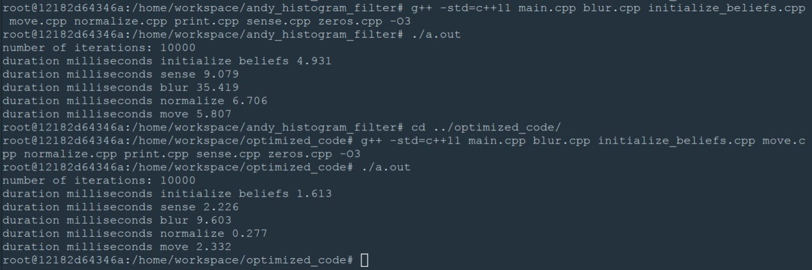

## Optimize Histogram Filter Contest ##

One of the optional projects of the Intro to Self-Driving Cars nanodegree was a little, inofficial speed optimization contest.

The result was a very interesting head to head race with another student called Carsten Grimm which ended in a draw like shown below:

**This version's results**:

**Carsten Grimm's results**:

Here you can find one of the two (very likely) winning codes of the ISDC October 2017 cohort.

Although it cost me a lot of hairs the whole idea was really a great fun :).

If you have still any suggestions for further improvement let me know!