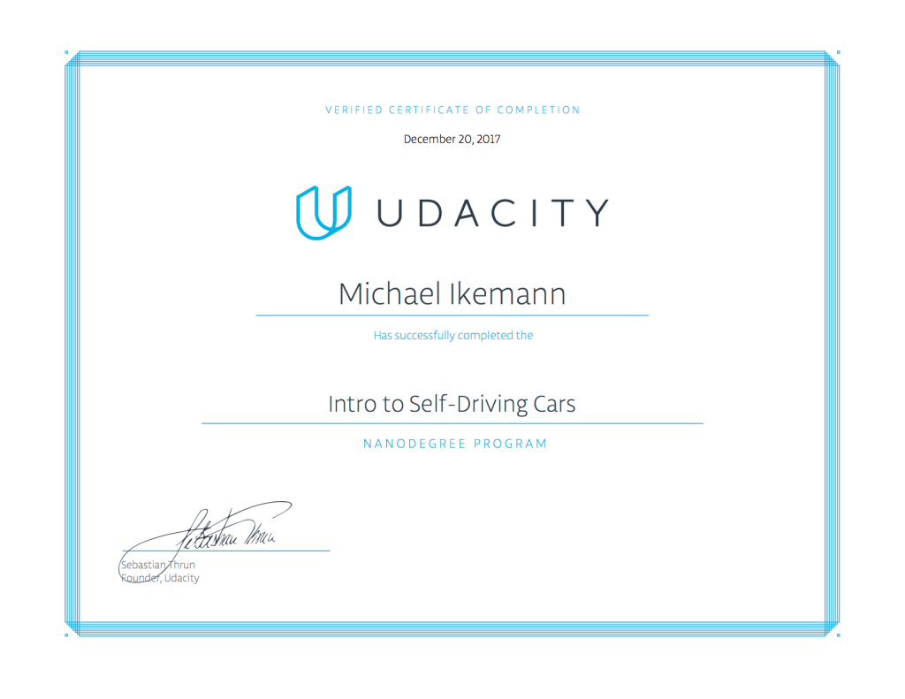
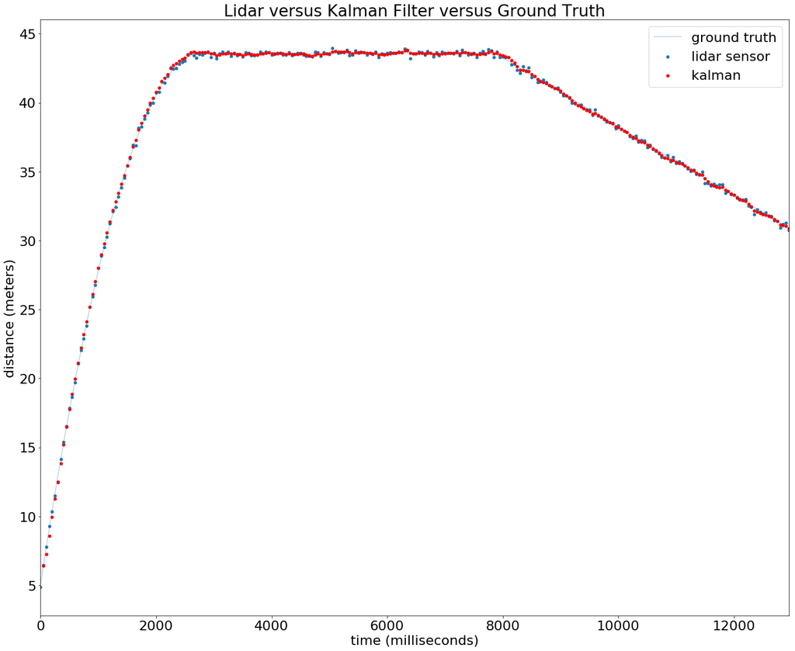
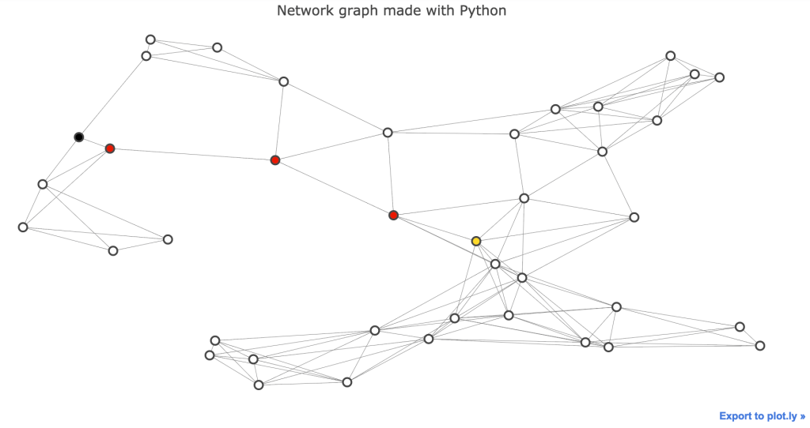
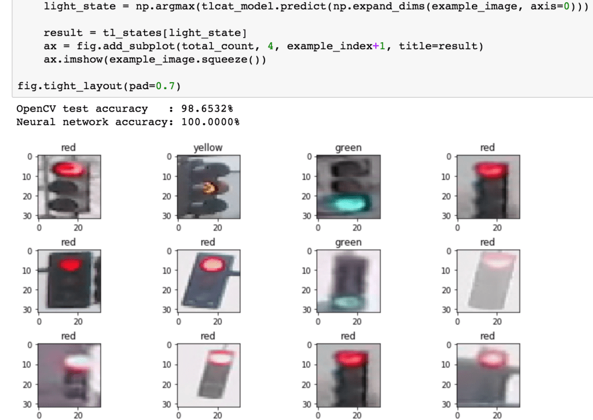
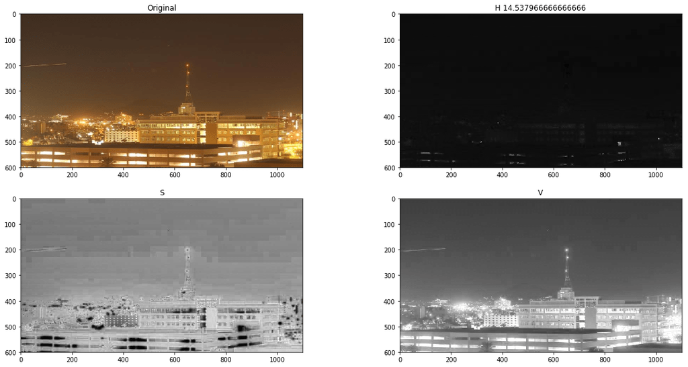
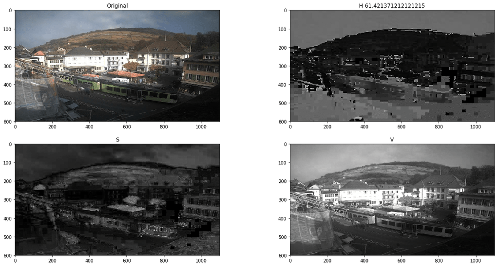
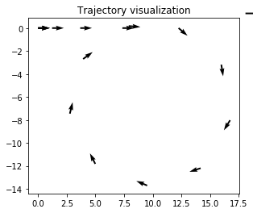
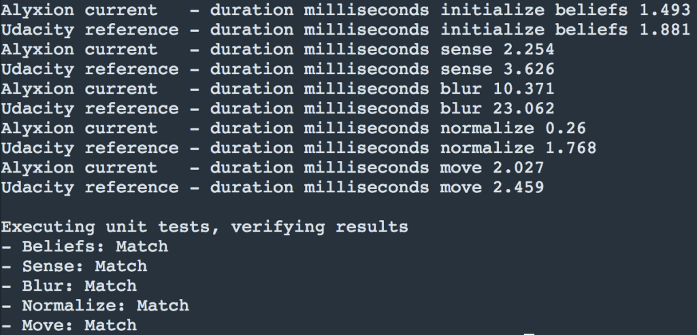

---

In this repository you can find my results of all projects and relevant exercises of the Udacity ISDC Nanodegree.

---

**Important note:**

If not noted otherwise the originals of all source and data files provided here are Copyright (C) Udacity.

Please use these files with respect to Udacity's honor code, do not destroy your own learning experience by copying & pasting theirs content into your solutions and do not claim them as your own.

For more details or if you want to sign up for this Nanodegree as well visit [www.udacity.com](http://www.udacity.com)

You are of course welcome to learn from the files provided here and even more welcome to let me know if you are a student of the ISDC as well and have improvement ideas for the tougher projects. :) 

Contact me on [LinkedIn](https://www.linkedin.com/in/michael-ikemann/)

---

## Chapters ##

The nanodegree was subdivided into the following chapters:

1. Orientation
2. Bayesian Thinking
3. Working with Matrices
4. C++ Basics
5. Performance Programming in C++
6. Navigating Data Structures
7. Vehicle Motion and Control
8. Computer Vision and Machine Learning

---

## Projects ##

The following rated projects were part of this nanodegree:

1. **JoyRide - Reverse parking of a self-driving car**
    
    - [Rating](2_2_Project_1_JoyRide/Project_1_Review.pdf)
2. **Implementation of a Matrix Class in Python**
    
    - [Source](3_5_Project_2_Implement_Matrix_Class/kalman_filter_demo.ipynb)
    - [Rating](3_5_Project_2_Implement_Matrix_Class/Project_2_Review.pdf)
3. **Translation of a Python Histogram Filter to C++**
    - [Source](4_6_Project_3_Translate_Python_To_C)
    - [Rating](4_6_Project_3_Translate_Python_To_C/Project_3_Review.pdf)
4. **A Star routing algorithm in Python**
    
    - [Source](6_4_Project_4_Route_Planner/project_notebook.ipynb)
    - [Rating](6_4_Project_4_Route_Planner/Project_4_Review.pdf)
5. **Computer Vision based Traffic Light Classifier**
    
    - [Source](8_2_Project_5_Traffic_Light_Classifier/Traffic_Light_Classifier.ipynb)
    - [Rating](8_2_Project_5_Traffic_Light_Classifier/Project_5_Review.pdf)

---

## Interesting optional projects ##

- **Day / Night detection by color channel analysis**
    - 
    - 
    - [Source](8_1_Day_Night_Classification_Mini_Projects/47_Accuracy%20and%20Misclassification.ipynb)
- **Trajectory Reconstruction using Accelerometer**
    - 
    - [Source](7_3_Keeping_Track_Mini_Projects/Keeping%20Track%20of%20x%20and%20y.ipynb)
- **Histogram filter optimization contest**
    - 
    - [Source](5_3_Optimize_Histogram_Filter_Cpp)