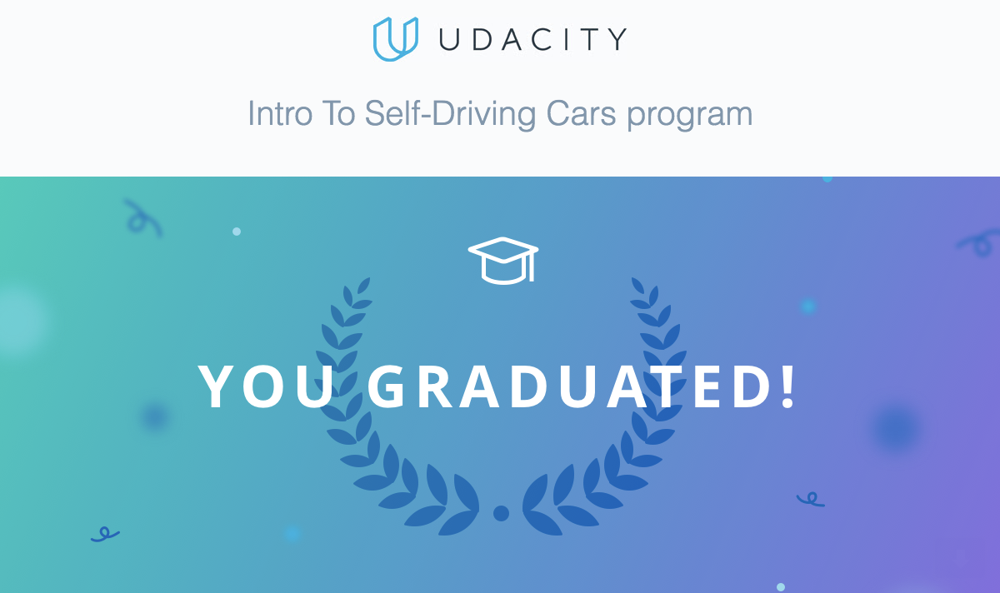

---

In this repository you can find my results of all projects and relevant exercises of the Udacity ISDC Nanodegree.

---

**Important note:**

All data files provided here are Copyright (C) Udacity, all modifications of the originals Copyright (C) Michael Ikemann, if not noted otherwise.

Please do neither copy nor clone any of these files and majorly with respect to Udacity's honor code do not use any of the solutions provided here in any of your rated projects.

You are of course welcome to learn from the files provided here and even more welcome to let me know if you are a student of the ISDC as well and have improvement ideas for the really tougher projects. :) 

Contact me on [LinkedIn](https://www.linkedin.com/in/michael-ikemann/)

---

## Chapters ##

The nanodegree was subdivided into the following chapters:

1. Orientation
2. Bayesian Thinking
3. Working with Matrices
4. C++ Basics
5. Performance Programming in C++
6. Navigating Data Structures
7. Vehicle Motion and Control
8. Computer Vision and Machine Learning

---

## Projects ##

The following rated projects were part of this nanodegree:

1. JoyRide - Reverse parking of a self-driving car
2. Implementation of a matrix class in Python
3. Translation of a Python histogram filter to C++
4. Implementation of the A* routing algorithm in Python
5. Implementation of a computer vision based traffic light classifier

 